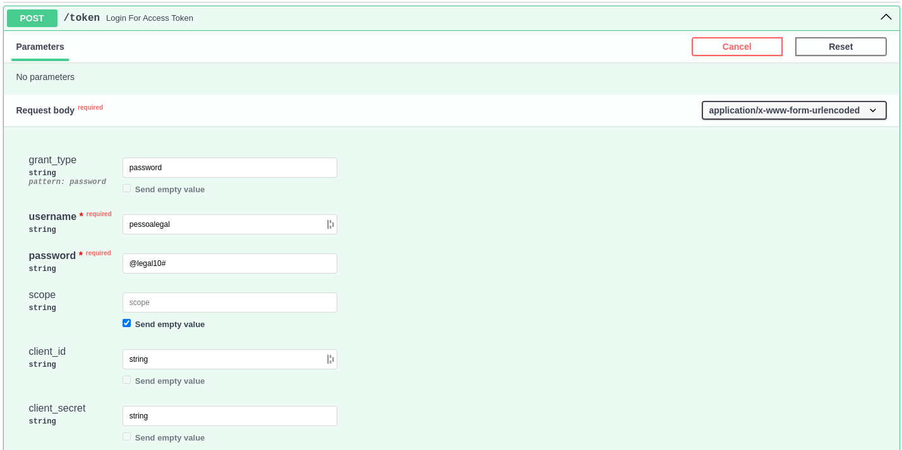
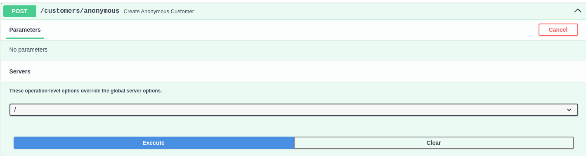

# Passo a Passo para Testar o Backend

## :material-foot-print: Passos
Nessa documentação iremos te mostrar os Passos que você deve dar em direção aos testes. Isso irá lhe proporcionar uma
melhor experiência durante os teste. Abaixo, clique em cada uma das caixas de passos para seguir com cada etapa.

???- note "Passo 01: Login for Access Token"
    A primeira coisa que deve ser feita é a criação de um Token usando um dos Usuários Admin. 
    Você poderá fazer isso atráves do Swagger em
    [Login for Access Token](http://localhost:2000/docs#/default/login_for_access_token_token_post).
    
    Preencha campos **username** com "Admin User" e **password** com "your_password", por fim, preencha o client_id com
    o número 1. Clique em Execute. Isso te dará acesso às etapas que exigem camadas de autenticação do token.

### Cenário 1: Cliente Anônimo

???- note "Passo 02: Fazendo Pedido Sem Identificação"
    Nosso Backend foi feito com a possibilidade de que um cliente possa fazer seu pedido sem a necessidade de criar um
    cadastro se identificando. E para isso, basta seguir os itens abaixo.  
    Você poderá fazer isso atráves do Swagger em
    [Create Anonymous Customer](http://localhost:2000/docs#/customers/create_anonymous_customer_customers_anonymous_post).
    
    Basta clicar em Executar e o Usuário Anônimo será criado.

### Cenário 2: Cliente Cadastrado
    Cliente com Identificação
    Cria Conta com Identificação

3. Jornada do Cliente
    1. Cria Order
    2. Adiciona Produtos ao Pedido
    3. Faz Pagamento (Fake Checkout)

4. Jornada da Lanchonete
    1. Lista Pedidos que Tiveram Sucesso no Fake Checkout 
    2. Recebe Pedido com Status Aberto
    3. Possibilidade de Filtrar por Categoria
    4. Atualiza Status para Finalizado

5. Fluxo de Cadastro de Produto
    2. Criar
    3. Editar
    4. Excluir