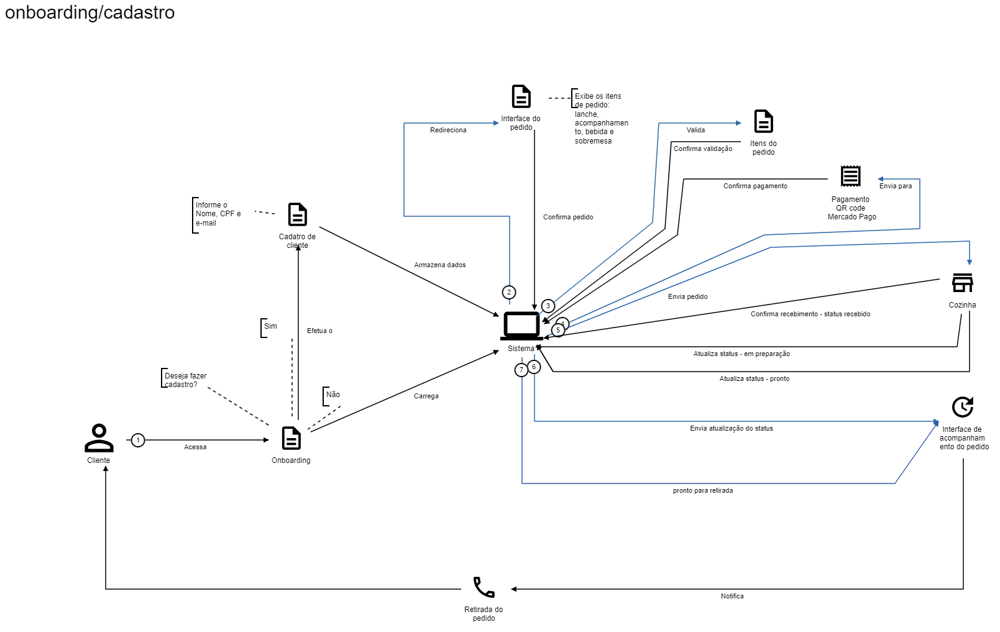

# Tech Challenge SOAT - Lanchonete de Bairro

O **cliente** é qualquer pessoa que deseja fazer pedido na lanchonete, o atendente é funcionário que auxilia no atendimento aos clientes, caso necessário. O autoatendimento é o sistema que permitirá ao cliente fazer o pedido sem a interação direta com um atendente na lanchonetex. A preparação ou cozinha é a area onde os pedidos são preparados e atualizados (status do pedido).

## :material-directions: Domínio e Subdomínios

O domínio principal do tech challenge é a Lanchonete, onde abrange as operações e processos relacionados ao funcionamento da lanchonete, desde a seleção de produtos até o gerenciamento de pedidos e clientes.

Os subdomínios são:

- **Cliente:** gestão das informações dos clientes.
- **Pedido:** cria, gerencia e acompanha os pedidos dos clientes.
- **Produto:** gestão dos produtos oferecidos pela lanchonete.

## :octicons-zoom-in-16: Detalhamento dos Contextos e Agregados

- **Cliente:** Contém as informações de identificação dos clientes que optaram por fazer o cadastro na plataforma;
- **Pedido:** Cria e acompanha os pedidos. Contém os itens do pedido, ou seja, lanche, acompanhamento, bebida e sobremesa. É o que o cliente deseja comprar.  
    - **Produção/Cozinha:** Prepara e atualiza o status do pedido;
- **Pagamento:** Responsável por processar o pagamento via QRCode que é efetuado pelo cliente.

## :fontawesome-solid-list: Processos

- **Identificação do Cliente:** O cliente se identifica via CPF, o cadastro é feito com nome e e-mail; Pode optar por não se identificar;
- **Montar Pedido:** Cliente seleciona os itens: lanche, acompanhamento, bebida e sobremesa. Todos os itens são opcionais.
- **Confirmação do Pedido:** O cliente finaliza a montagem do pedido e efetua pagamento.
- **Processo de Pagamento:** O cliente paga via QRCode do Mercado Pago.
- **Pedido Enviado para Produção:** Após confirmação do pagamento o sistema envia o pedido para preparação, ou seja, cozinha da lanchonetex.
- **Preparação do Pedido:** a cozinha recebe o pedido (status recebido); a cozinha inicia a preparação do pedido (status em preparação); cozinha finaliza a produção do pedido (pedido ponto para retirada); cliente é notificado que o pedido está pronto para retirada; 
- **Status do Pedido:** Fases pelas quais um pedido passa: Recebido, Em Preparação, Pronto para Retirada e Finalizado.
- **Retirada do Pedido:** o cliente retira o pedido; o sistema atualiza o status do pedido para finalizado;

## :material-account-voice: Narrativa dos Processos

### Natural

O processo de pedido de lanches começa quando um cliente deseja fazer um pedido, o cliente vai até o atendente da lanchonete e solicita o cardápio da unidade. O atendente anota os itens do pedido do cliente, com a alta demanda por conta do sucesso da lanchonete o volume de atendimento pode ser caótico e confuso, por isso, podem ocorrer erros quando um cliente solicita personalização do lanche, podendo causar ruído entre solicitação do pedido e execução no preparo do mesmo.

### :material-robot: Digitalizado

O cliente que deseja fazer um pedido na lanchonete dirige-se a tela de autoatendimento e escolhe se fará cadastro indicando nome, CPF e e-mail. O cliente tem opção de não fazer cadastro na plataforma e seguir para interface do pedido. 

Na interface de pedido é exibido os itens de pedido que são: lanche, acompanhamento, bebida e sobremesa. Além disso, cada item terá sua descrição e o preço. Todos os itens são opcionais mas o pedido só poderá ser confirmado se houver ao menos um item selecionado, caso não tenha nenhum item selecionado deverá ser exibida uma mensagem informativa: “Por favor, selecione um item para prosseguir com seu pedido”.

 Após o cliente finalizar a seleção de itens é mostrado o resumo ou lista dos itens selecionados, o cliente deverá confirmar para seguir com o pagamento. É feito o redirecionamento do pagamento que exibe o meio de pagamento por QR code do Mercado Pago. O cliente deve seguir com o fluxo do checkout externo. 

Após confirmação do pagamento o código do pedido é gerado, o pedido será encaminhado para cozinha. A cozinha recebe o pedido. O pedido irá para status em preparação assim que a cozinha retirar o pedido da impressora e adicionar no quadro de preparação. A equipe da cozinha/preparação sinalizará quando o pedido estiver pronto. 

O cliente poderá visualizar o status do pedido nos monitores da lanchonete ou pelo celular conectado na rede sem fio da lanchonete usando o endereço lanchonetex.pedido.local/acompanhar_pedido indicando o código do pedido. 

Quando o pedido estiver com status de pronto o sistema notificará o cliente com a mensagem: “Seu pedido está pronto para retirada, por favor dirija-se ao balcão de retirada”. O atendente confirmará a retirada e finaliza o processo do pedido. O sistema enviará uma pesquisa de satisfação para o cliente.

O sistema deverá exibir na área administrativa (interface de atendimento) todos os pedidos em preparação ou andamento e o tempo de espera.

## :material-image: Documentação Pictográfica

 Cadastro, Pedido e Pagamento

