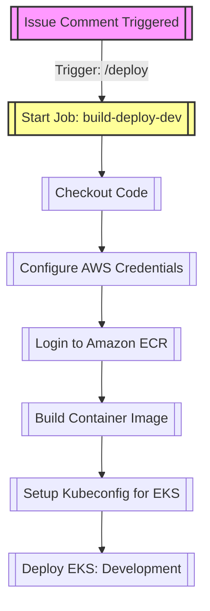
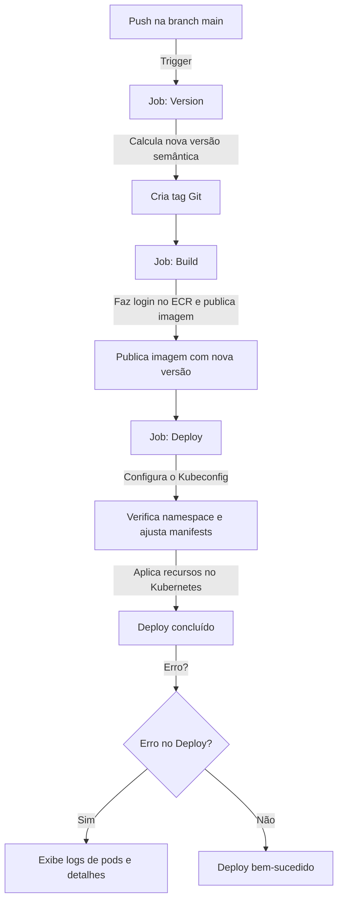

# CICD using GitHub Actions Workflow to deploy code in EKS cluster

Este projeto utiliza o GitHub Actions para automatizar as etapas de versionamento, build e publicação de imagens de contêiner no Amazon ECR, além do deploy em um cluster EKS. O fluxo foi projetado para garantir simplicidade e continuidade nos processos, com gatilhos configurados para pipelines específicos de acordo com o ambiente.
Deploy em Ambiente Não-Produtivo

No ambiente não-produtivo, o versionamento das imagens segue o padrão do commit SHA do GitHub, acompanhado do sufixo -dev. Esse pipeline é ativado por meio de um comentário /deploy em um Pull Request. O deploy é realizado no cluster EKS no namespace development.
Deploy em Ambiente Produtivo

Para o ambiente de produção, adota-se o versionamento semântico para as imagens, com um controle rigoroso da nomenclatura de branches, conforme descrito abaixo:

    Patch Version (Correção de bugs): Prefixo `bugfix/`.
    Minor Version (Novas funcionalidades sem mudanças incompatíveis): Prefixo feature/.
    Major Version (Mudanças incompatíveis ou significativas): Prefixo release/.
    Documentação ou Ajustes Diversos: Prefixos doc/ ou misc/ — usados apenas para incrementar a versão de build (ex.: v0.0.0+1).

Benefícios do Workflow

    Automação completa: Reduz a intervenção manual e agiliza os processos de build e deploy.
    Controle de qualidade: Facilita a separação clara entre ambientes de desenvolvimento e produção.
    Rastreabilidade: Garante que cada versão seja facilmente identificável por meio de padrões definidos de nomenclatura e versionamento.

# :material-foot-print: Workflow de Deploy para o Ambiente de Desenvolvimento

Este workflow do GitHub Actions automatiza o processo de deploy para o ambiente de desenvolvimento ao detectar um comentário específico (/deploy) em uma issue. Essa funcionalidade atende aos requisitos de integração e entrega de código no workload, promovendo a adoção de práticas de integração e deploy contínuos.

# :material-foot-print: Fluxograma do Workflow Não-Produtivo

### Detalhes

    Etapas:
    - Condição: Executa apenas se o corpo do comentário contiver /deploy.
    - Checkout do código: Faz o checkout do repositório usando actions/checkout@v2.
    - Configuração das credenciais AWS: Configura as credenciais da AWS utilizando aws-actions/configure-aws-credentials@v1.
    - Login no registro ECR: Realiza o login no ECR usando aws-actions/amazon-ecr-login@v1.
    - Build e push da imagem de contêiner:
        Constrói a imagem Docker e a envia para o repositório ECR.
        Utiliza o SHA do commit com o sufixo -dev como versão da imagem.
        Define a versão da imagem no ambiente do GitHub.
    - Configuração do Kubeconfig: Configura o kubectl para usar o cluster EKS especificado.
    - Deploy no namespace development do cluster EKS:
        Utiliza o kustomize para ajustar a versão da imagem.
        Verifica se o namespace development existe, criando-o se necessário.
        Aplica os manifests Kubernetes com kubectl apply -k.

Observações:

    O workflow utiliza o kustomize para personalização dos recursos Kubernetes.
    O processo de deploy inclui tratamento de erros para relatar detalhes dos pods em caso de falha.

# :material-foot-print: Workflow de Deploy para o Ambiente de Produção

Este workflow automatiza o processo de versionamento, build, publicação de imagem Docker no Amazon ECR e deploy no ambiente de produção no cluster Kubernetes gerenciado pelo EKS. Ele é acionado automaticamente ao realizar um push na branch main.

# :material-foot-print: Fluxograma do Workflow de Produção

### Detalhes

1. Gerenciamento de Versão

Este job calcula e cria uma nova versão semântica baseada no histórico de commits.
Este job é executado apenas quando há um push para a branch main e não é acionado pelo bot do GitHub Actions. A saída deste job é uma nova versão semântica, armazenada na variável `semver_tag`.

    Etapas:
    - Checkout do repositório: Garante acesso ao histórico completo dos commits.
    - Listagem de tags Git: Identifica a versão mais recente.
    - Cálculo de nova versão: Utiliza o branching model trunk-based para determinar a próxima versão.
    - Criação de tag Git: Cria e associa a nova tag ao commit atual.

2. Build e Push da Imagem Docker

Este job constrói a imagem Docker da aplicação e publica no Amazon ECR.

    Etapas:
    - Checkout do repositório.
    - Configuração de credenciais AWS: Configura acesso seguro para interagir com o ECR.
    - Login no registro ECR: Autentica no ECR privado.
    - Build e push da imagem Docker:
        Utiliza a nova versão semântica como tag da imagem.
        Faz o push da imagem para o ECR.

3.  Deploy no Kubernetes

Este job realiza o deploy da aplicação no ambiente de produção, utilizando o namespace production.

    Etapas:

    - Checkout do repositório.
    - Configuração de credenciais AWS.
    - Setup do Kubeconfig: Configura o acesso ao cluster EKS.
    - Deploy com kustomize:
        Verifica se o namespace production existe, criando-o caso necessário.
        Ajusta a versão da imagem no diretório infra/kubernetes/production.
        Aplica os manifests no cluster Kubernetes.
        Em caso de erro, exibe detalhes dos pods para facilitar a depuração.

Observações

    Controle de versão: Utiliza o SemVer para versionamento consistente.
    Personalização Kubernetes: O deploy utiliza o kustomize para gerenciar configurações específicas do ambiente.
    Tratamento de erros: Logs detalhados são exibidos em caso de falha no deploy, facilitando a análise.
