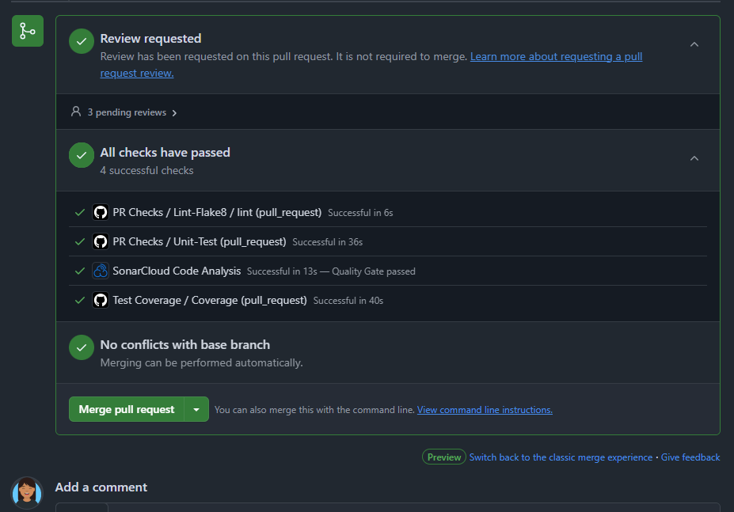

# Continuous integration and continuous delivery

---

Nesta quarta entrega, apresentamos os processos para a implementação do Tech Challenge, cujo objetivo é desenvolver uma plataforma de vendas para uma lanchonete de bairro em plena expansão. Este documento detalha os testes unitários, cobertura de código e o fluxo de deploy baseado na branch principal.

A implementação foi realizada utilizando o mesmo ambiente configurado na [fase 3](https://software-architecture-fiap.github.io/tech-challenge/fase_3/eks_infra_cicd/), garantindo consistência e continuidade.

Para mais detalhes, consulte os manifestos do Terraform disponíveis no repositório [infra-kitchen](https://github.com/software-architecture-fiap/infra-kitchen).

---

## :material-wrench-outline: Checks de PR

Cada repositório de serviço possui um pipeline automatizado para verificar a qualidade do código e a execução de testes unitários sempre que há mudanças no código.

- Análise de código com Flake8: Valida a conformidade do código com as melhores práticas do Python.
- Execução de testes unitários:
  - Configuração do ambiente com Python 3.10 e Poetry.
  - Instalação de dependências via Poetry.

#### Execução de testes com pytest e cobertura de código.

## :material-wrench-outline: Cobertura de código

O pipeline de cobertura de código é acionado via push na branch principal e em pull requests, garantindo que a cobertura mínima seja respeitada. Execução dos testes com cobertura inclui:

- O pytest é executado com pytest-cov.
- O relatório de cobertura é gerado no formato XML.

Caso a cobertura fique abaixo de 75%, o pipeline falha, upload do relatório de cobertura como artefato no GitHub Actions.

## :material-wrench-outline: Pipeline de Deploy

O deploy é acionado via comentário no PR (/deploy). O GitHub Actions executa as seguintes etapas:

- Build da imagem Docker com a tag baseada no commit SHA.
- Push da imagem para o Amazon ECR.
- Atualização do Kustomize para utilizar a nova imagem.
- Aplicar as configurações no cluster Kubernetes.

No ambiente de desenvolvimento o eploy acionado com `/deploy` em um PR.

Mais detalhe da execução do pipeline [clique aqui](https://github.com/software-architecture-fiap/tech-challenge/actions/runs/13402806439/job/37437040963?pr=84)

No Ambiente de Produção o versionamento é baseado em semver e nas seguintes regras de nome de branch:

- bugfix/ → Patch version
- feature/ → Minor version
- release/ → Major version
- doc/ ou misc/ → Apenas incrementação de build
