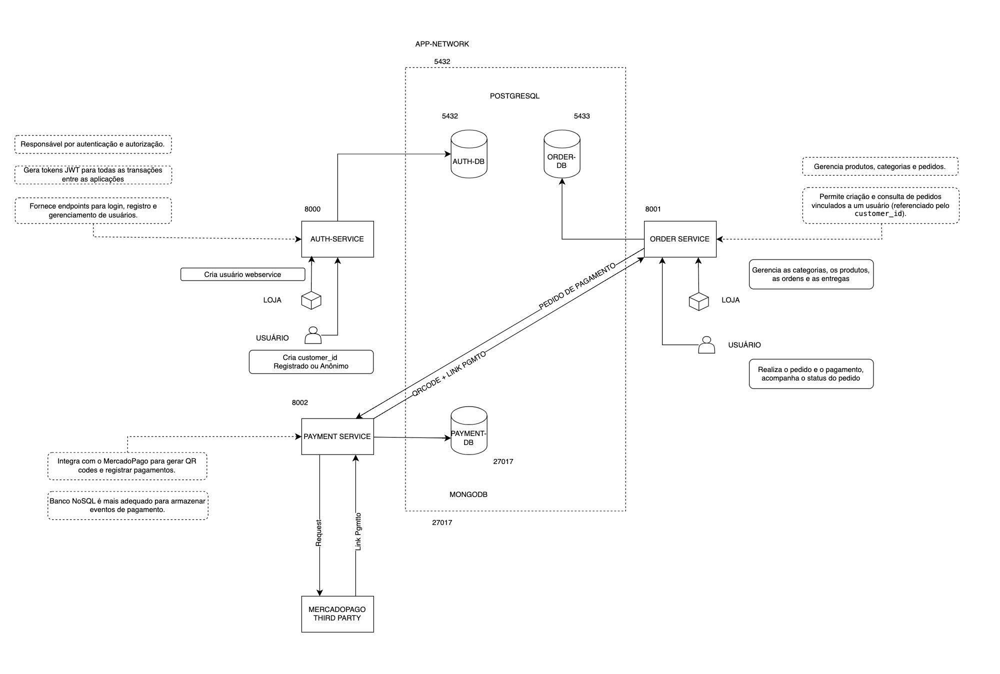

# Arquitetura de microsserviços

Nesta documentação, detalharemos três microsserviços principais da nossa plataforma:

1. **Auth Service**: Responsável pela autenticação de usuários e geração de tokens JWT.
2. **Payment Service**: Gerencia a integração de pagamentos através do MercadoPago.
3. **Order Service**: Cuida do gerenciamento de pedidos e sua interação com o Payment Service.

Cada serviço é desenvolvido utilizando tecnologias específicas e possui funcionalidades e endpoints próprios, garantindo uma arquitetura modular e escalável.

### Desenho da arquitetura atualizada com os microsserviços

## :material-wrench-outline: Auth service

Esse microsserviço é responsável pela etapa de autenticação de clientes identificados, não identificados e usuários administrativos. Além disso, esse serviço também faz a geração de tokens JWT para autenticação em outro serviços. Contendo os endpoints para o gerenciamento de usuários.

### :material-dots-circle: Funcionalidades

- **Autenticação de usuários:** Geração de tokens JWT para autenticação.
- **Cadastro de usuários:** Permite que novos usuários se cadastrem no sistema.
- **Validação de tokens:** Valida se os tokens enviados em requisições são válidos.
- **Integração com outros** serviços: O Auth Service é consumido por outros serviços para validar a autenticidade de requisições.

### :material-code-json: Endpoints

- POST /token: Solicita um bearer token.
- GET /auth: Valida a autorização do bearer token.
- POST /customers/admin: Cria o usuário administrador da aplicação
- GET /customer/: Recupera a lista de usuários cadastrados.
- POST /customer/identify: Identifica um usuário pelo CPF.
- POST /customer/register: Criar o usuário identificado.
- POST /customer/anonymous: Criar o usuário anônimo.

## :material-wrench-outline: Payment service

Esse microsserviço é parte essencial da plataforma de vendas da lanchonete, gerenciando a integração de pagamentos através do MercadoPago. Ele é responsável por gerar QR codes para pagamentos e registrar todo o fluxo de transações, garantindo a segurança e a integridade dos dados armazenados.

### :material-dots-circle: Detalhes do funcionamento

Utilizamos o FastAPI como framework para desenvolvimento de APIs. O MongoDB é o banco de dados NoSQL utilizado para armazenar dados de transações, e a interação com o MongoDB é feita através do driver pymongo. Para a integração com o sistema de pagamentos MercadoPago, utilizamos o MercadoPago SDK. Além disso, o Poetry é utilizado como gerenciador de dependências e ambiente virtual.

## :material-wrench-outline: Order service

O Order service gerencia os pedidos da lanchonete, atualizando os status dos pedidos e interagindo com o payment service para a realização de pagamentos.

### :material-dots-circle: Funcionalidades

- **Criação de pedidos:** Permite a criação de novos pedidos a partir de um cliente autenticado.
- **Atualização de status:** Permite que o status do pedido seja atualizado, como paid, preparing, delivered, etc.
- **Integração com serviço de pagamento:** Comunica-se com um serviço de pagamento para gerar links de pagamento ou QR codes.
- **Gerenciamento de produtos e categorias:** Ações CRUD (Create, Read, Update, Delete) para produtos e categorias.
- **Rastreamento de pedidos:** Permite o rastreamento do status de cada pedido.
