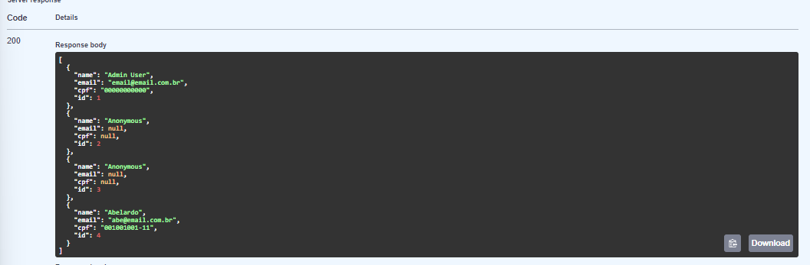
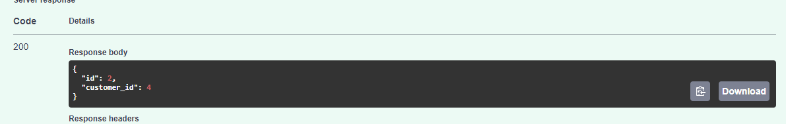

# Passo a Passo para Testar o Backend

## :material-foot-print: Passos
Essa documentação fornece um passo a passo detalhado para realizar testes no backend do nosso projeto. Clique nas caixas abaixo para avançar em cada etapa do processo.

### Autenticação e autorização

???- note "Login for Access Token and Authorize"
    O primeiro passo a ser feito é a o de  criação de Token usando um dos usuários administrativos. 
    Usando o Swagger, você poderá fazer isso em 
    [Login for Access Token](http://localhost:2000/docs#/default/login_for_access_token_token_post).
    .
    Clique em **Try it out** e depois preencha os campos **username** com "email@email.com.br" e **password** com "your_password", por fim, preencha o **client_id** com
    o número **1**. Clique no botão **Execute**, isso permitirá o acesso às etapas que exigem camadas de autenticação do token.
    Além disso, ao tentar acessar um endpoint que requer autorização, por exemplo, **category**, **orders** e **products**. 
    
    Clique em **Authorize** e faça login usando seu e-mail e senha administrativo.


### Cenário onboarding: Cliente anônimo

???- note "Passo 01: Fazendo pedido sem identificação"
    Esse projeto foi desenvolvido com a possibilidade do cliente fazer o pedido sem ter que cadastrar seus dados. Seguindo os passos abaixo é possível executar esse fluxo.
    Usando o Swagger em 
    [Create Anonymous Customer](http://localhost:2000/docs#/customers/create_anonymous_customer_customers_anonymous_post).
    
    Clique em **Try it out** e em seguida **Execute**, o cliente anônimo será gerado.

### Cenário onboarding: Cliente identificado

???- note "Passo 02: Fazendo cadastro do cliente"
    Para os clientes que desejam fazer cadastro na aplicação basta usar o endpoint [customers/register](http://localhost:2000/docs#/customers/register_customer_customers_register_post) e preencher com os dados solicitados como no exemplo abaixo:

    ```json
    {
    "name": "Abelardo",
    "email": "abe@email.com.br",
    "cpf": "001001001-11",
    "password": "my_password"
    }
    ```

    Para certificar que o cliente foi registrado utilize o endpoint [customers/](http://localhost:2000/docs#/customers/read_customers_customers__get) e liste todos os clientes cadastrados.
     


### Cenário pedido: Seleção do pedido

???- note "Passo 03: Efetuando um pedido"
    Com o endpoint [orders/create_orders](http://localhost:2000/docs#/orders/create_order_orders__post) preencha com os valores de **customer_id** que foi cadastrado nos passos 01 ou 02 e **product_id** para adicionar o produto a um pedido, exemplo:

    ```json
    {
        "status": "string",
        "user_agent": "string",
        "ip_address": "string",
        "os": "string",
        "browser": "string",
        "device": "string",
        "comments": "string",
        "customer_id": 4,
        "products": [
            {
            "product_id": 10,
            "comment": "sem gelo"
            }
        ]
    }
    ```    
    Resultado da operação de seleção do pedido:
    


### Cenário pagamento: Processando o pagamento do pedido

???- note "Passo 04: Realizando pagamento do pedido (fake checkout)"
    Após executar o [orders/fake_checkout](http://localhost:2000/docs#/orders/fake_checkout_orders_checkout_post) siga para o fluxo de atualização de status do pedido.


### Cenário preparação e atualização do pedido: Status do pedido

???- note "Passo 05: Atualização de status de pedido"
    Com **order_id** é possível fazer a atualização de status de cada pedido, com o endpoint [orders/update_order_status](http://localhost:2000/docs#/orders/update_order_status_orders__order_id__status_put). Exemplo com valor de entrada usando o **order_id** 3:

    ```json
    {
        "status": "em preparação"
    }
    ```

???- note "Passo 06: Visualizando status do pedido"
    Ainda com o valor do **order_id** no endpoint [orders/read_order](http://localhost:2000/docs#/orders/read_order_orders__order_id__get) visualize o status atual do pedido. Exemplo valor de retorno:

    ```json
    {
    "id": 3,
    "customer_id": 4,
    "status": "em preparação"
    }
    ```


### Cenário preparação e atualização do pedido: Pedidos concluídos com sucesso no fake checkout
<!-- Lista Pedidos que Tiveram Sucesso no Fake Checkout -->

### Cenário preparação e atualização do pedido: Listando todos os pedidos registrados
???- note "Listando pedidos"
    Em [orders/read_orders](http://localhost:2000/docs#/orders/read_orders_orders__get
    ) é possível listar todos os pedidos feitos por cliente.

    ```json
        {
        "orders": [
            {
            "id": 1,
            "customer_id": 1
            },
            {
            "id": 2,
            "customer_id": 4
            },
            {
            "id": 3,
            "customer_id": 4
            },
            {
            "id": 4,
            "customer_id": 4
            }
        ]
        }    
    ```

### Cenário gerenciamento de produtos e categorias: Cadatro de produto

???- note "Cadastro de produto"
    Usando o endpoint [products/create_product](http://localhost:2000/docs#/products/create_product_products__post) é possível fazer o cadastro de um novo produto de acordo com as categorias previamente cadastradas. Exemplo com valores de entrada:

    ```json
    {
    "name": "Brigadeiro",
    "description": "Doce feito com leite condensado e achocolatado",
    "price": 3,
    "category_id": 5,
    "category": "Sobremesas"
    }
    ```


### Cenário gerenciamento de produtos e categorias: Listagem de categorias e produtos

???- note "Listando categorias e produtos"
    Usando o endpoint [category/list_categories](http://localhost:2000/docs#/category/list_categories_category__get) é possível fazer o cadastro de um novo produto de acordo com as categorias previamente cadastradas. Exemplo com valores que retornam nessa operação:

    ```json
    {
    "categories": [
        {
        "name": "Sanduíches",
        "id": 1,
        "products": [
            {
            "name": "Sanduíche de Frango Grelhado",
            "description": "Grilled chicken sandwich with lettuce and tomato",
            "price": 15,
            "category_id": 1,
            "category": "Sanduíches",
            "id": 1
            },
            {
            "name": "Cheeseburger Clássico",
            "description": "Classic cheeseburger with beef patty and cheese",
            "price": 12,
            "category_id": 1,
            "category": "Sanduíches",
            "id": 2
            },
            {
            "name": "Sanduíche Vegano de Grão-de-Bico",
            "description": "Vegan sandwich with chickpea patty",
            "price": 14,
            "category_id": 1,
            "category": "Sanduíches",
            "id": 3
            }
        ]
        },
        {
        "name": "Pizzas",
        "id": 2,
        "products": [
            {
            "name": "Pizza Margherita",
            "description": "Pizza with tomato sauce, mozzarella, and basil",
            "price": 25,
            "category_id": 2,
            "category": "Pizzas",
            "id": 4
            },
            {
            "name": "Pizza Pepperoni",
            "description": "Pizza with tomato sauce, mozzarella, and pepperoni",
            "price": 27,
            "category_id": 2,
            "category": "Pizzas",
            "id": 5
            },
            {
            "name": "Pizza Quatro Queijos",
            "description": "Pizza with four types of cheese",
            "price": 28,
            "category_id": 2,
            "category": "Pizzas",
            "id": 6
            }
        ]
        },
        {
        "name": "Acompanhamentos",
        "id": 3,
        "products": [
            {
            "name": "Batata Frita",
            "description": "Portion of crispy french fries",
            "price": 8,
            "category_id": 3,
            "category": "Acompanhamentos",
            "id": 7
            },
            {
            "name": "Anéis de Cebola",
            "description": "Portion of breaded onion rings",
            "price": 9,
            "category_id": 3,
            "category": "Acompanhamentos",
            "id": 8
            },
            {
            "name": "Salada Caesar",
            "description": "Caesar salad with lettuce, croutons, and parmesan cheese",
            "price": 10,
            "category_id": 3,
            "category": "Acompanhamentos",
            "id": 9
            }
        ]
        },
        {
        "name": "Bebidas",
        "id": 4,
        "products": [
            {
            "name": "Coca-Cola",
            "description": "Cola soft drink",
            "price": 5,
            "category_id": 4,
            "category": "Bebidas",
            "id": 10
            },
            {
            "name": "Suco de Laranja",
            "description": "Natural orange juice",
            "price": 6,
            "category_id": 4,
            "category": "Bebidas",
            "id": 11
            },
            {
            "name": "Água Mineral",
            "description": "Still mineral water",
            "price": 4,
            "category_id": 4,
            "category": "Bebidas",
            "id": 12
            }
        ]
        },
        {
        "name": "Sobremesas",
        "id": 5,
        "products": [
            {
            "name": "Brownie de Chocolate",
            "description": "Chocolate brownie with walnuts",
            "price": 7,
            "category_id": 5,
            "category": "Sobremesas",
            "id": 13
            },
            {
            "name": "Torta de Maçã",
            "description": "Apple pie with cinnamon",
            "price": 8,
            "category_id": 5,
            "category": "Sobremesas",
            "id": 14
            },
            {
            "name": "Sorvete de Baunilha",
            "description": "Vanilla ice cream",
            "price": 6,
            "category_id": 5,
            "category": "Sobremesas",
            "id": 15
            },
            {
            "name": "Brigadeiro",
            "description": "Doce feito com leite condensado e achocolatado",
            "price": 3,
            "category_id": 5,
            "category": "Sobremesas",
            "id": 16
            },
            {
            "name": "Brigadeiro",
            "description": "Doce feito com leite condensado e achocolatado",
            "price": 3,
            "category_id": 5,
            "category": "Sobremesas",
            "id": 17
            },
            {
            "name": "Brigadeiro",
            "description": "Doce feito com leite condensado e achocolatado",
            "price": 3,
            "category_id": 5,
            "category": "Sobremesas",
            "id": 18
            },
            {
            "name": "Brigadeiro",
            "description": "Doce feito com leite condensado e achocolatado",
            "price": 3,
            "category_id": 5,
            "category": "Sobremesas",
            "id": 19
            }
        ]
        }
    ]
    }
    ```