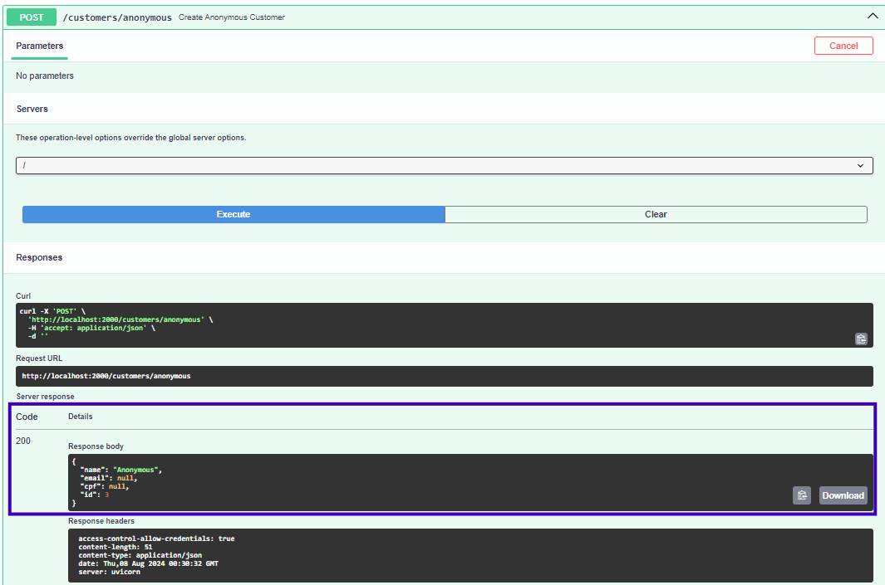

# Passo a Passo para Testar o Backend

## :material-foot-print: Passos
Essa documentação fornece um passo a passo detalhado para realizar testes no backend do nosso projeto. Clique nas caixas abaixo para avançar em cada etapa do processo.

### Autenticação e autorização

???- note "Passo 01: Login for Access Token"
    O primeiro passo a ser feito é a o de  criação de Token usando um dos usuários administrativos. 
    Usando o Swagger, você poderá fazer isso em 
    [Login for Access Token](http://localhost:2000/docs#/default/login_for_access_token_token_post).
    
    Clique **Try it out** e depois preencha os campos **username** com "email@email.com.br" e **password** com "your_password", por fim, preencha o **client_id** com
    o número **1**. Clique no botão **Execute**, isso permitirá o acesso às etapas que exigem camadas de autenticação do token.

???- note "Authorize"
    Além disso, é importante citar que ao tentar acessar algum endpoint que necessita de autorização é importante clicar em **Authorize** e fazer login usando email e senha.
    
    

### Cenário onboarding: Cliente Anônimo

???- note "Passo 02: Fazendo Pedido Sem Identificação"
    Esse projeto foi desenvolvido com a possibilidade do cliente fazer o pedido sem ter que cadastrar seus dados. Seguindo os passos abaixo é possível executar esse fluxo.
    Usando o Swagger em 
    [Create Anonymous Customer](http://localhost:2000/docs#/customers/create_anonymous_customer_customers_anonymous_post).
     clique em **Try it out** e em seguida **Execute**, o cliente anônimo será gerado.

### Cenário onboarding: Cliente Cadastrado

Para os clientes que desejam fazer cadastro na aplicação basta usar o endpoint [customers/register](http://localhost:2000/docs#/customers/register_customer_customers_register_post) e preencher com os dados solicitados como no exemplo abaixo:

```json
{
  "name": "Abelardo",
  "email": "abe@email.com.br",
  "cpf": "001001001-11",
  "password": "my_password"
}
```

Para certificar que o cliente foi registrado utilize o [customers/](http://localhost:2000/docs#/customers/read_customers_customers__get)
 


### Cenário pedido: Seleção do Pedido
<!-- TODO -->

<!-- 1. Criar pedido no endpoint orders
    2. Adicionar produtos ao pedido -->

### Cenário pagamento: Processando Pagamento
<!-- TODO -->
<!-- 3. Faz Pagamento (Fake Checkout) -->


### Cenário preparação e atualização do pedido: Efetuando Pagamento
<!-- TODO -->


### Cenário gerenciamento de produtos e categorias: Efetuando Pagamento
<!-- TODO -->

<!-- Jornada da Lanchonete
<!-- 1. Lista Pedidos que Tiveram Sucesso no Fake Checkout
2. Recebe Pedido com Status Aberto
3. Possibilidade de Filtrar por Categoria
4. Atualiza Status para Finalizado
3. Fluxo de Cadastro de Produto
    1. Criar
    2. Editar
    3. Excluir -->