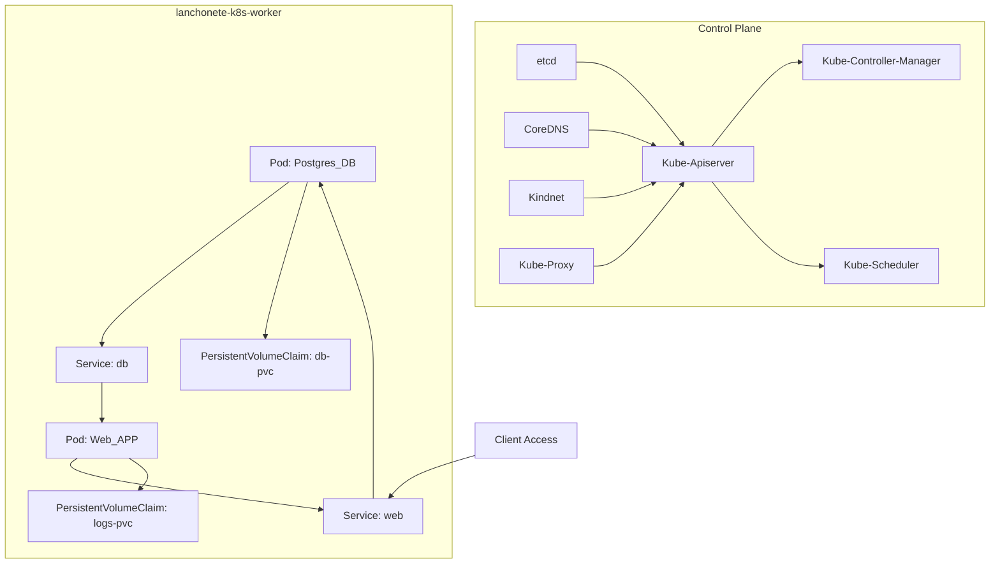
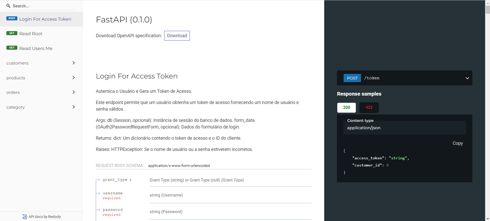

## Infra Kubernetes

### Arquitetura



### Pré-requisitos
- [Kind](https://kind.sigs.k8s.io/docs/user/quick-start/#installation)
- [Kubectl](https://kind.sigs.k8s.io/docs/user/quick-start/#installation)
- [Docker](https://docs.docker.com/engine/install/)
- [Kustomize](https://kustomize.io/)


Nessa primeira versão nossa aplicação ficará disponível em cluster Kubernetes local usando o Kind. Por favor, certifique-se de que as ferramentas de pré-requisitos estão instaladas, como nos exemplos:

```bash
❯ kind version
kind v0.24.0 go1.22.6 linux/amd64
```

```bash
❯ kubectl version
Client Version: v1.29.2
Kustomize Version: v5.0.4-0.20230601165947-6ce0bf390ce3
Server Version: v1.31.0
```

### Configurando os clusters usando o Kind

- Execute o script dentro de `./infra/scripts/setup.sh`
- Aguarde alguns minutos até os cluster serem criados, como no exemplo abaixo:
```bash
❯ ./infra/scripts/setup.sh
Creating cluster "lanchonete-k8s" ...
 ✓ Ensuring node image (kindest/node:v1.31.0) 🖼
 ✓ Preparing nodes 📦 📦
 ✓ Writing configuration 📜
 ✓ Starting control-plane 🕹️
 ✓ Installing CNI 🔌
 ✓ Installing StorageClass 💾
 ✓ Joining worker nodes 🚜
Set kubectl context to "kind-lanchonete-k8s"
You can now use your cluster with:

kubectl cluster-info --context kind-lanchonete-k8s

Not sure what to do next? 😅  Check out https://kind.sigs.k8s.io/docs/user/quick-start/
```

- Ao final execute `kind get clusters` que deverá exibir o resultado abaixo:

``` bash
lanchonete-k8s
```
- Com `kubectl get nodes` você visualizará um node control plane e um worker:

```bash
NAME                           STATUS   ROLES           AGE   VERSION
lanchonete-k8s-control-plane   Ready    control-plane   32m   v1.31.0
lanchonete-k8s-worker          Ready    <none>          32m   v1.31.0
```
- Após isso, execute `kubectl get pods -A` para listar todos os pods de todos os namespaces existentes no cluster.

```bash
NAMESPACE            NAME                                                   READY   STATUS    RESTARTS   AGE
kube-system          coredns-6f6b679f8f-sj9mn                               1/1     Running   0          83s
kube-system          coredns-6f6b679f8f-vqssg                               1/1     Running   0          83s
kube-system          etcd-lanchonete-k8s-control-plane                      1/1     Running   0          88s
kube-system          kindnet-blq2k                                          1/1     Running   0          84s
kube-system          kindnet-kk4lm                                          1/1     Running   0          80s
kube-system          kube-apiserver-lanchonete-k8s-control-plane            1/1     Running   0          88s
kube-system          kube-controller-manager-lanchonete-k8s-control-plane   1/1     Running   0          88s
kube-system          kube-proxy-2frwg                                       1/1     Running   0          80s
kube-system          kube-proxy-6bhr6                                       1/1     Running   0          84s
kube-system          kube-scheduler-lanchonete-k8s-control-plane            1/1     Running   0          88s
local-path-storage   local-path-provisioner-57c5987fd4-r4tw4                1/1     Running   0          83s
```


### Build do container e publicação no cluster Kind

Agora que o cluster está ativo é necessário fazer o build da imagem container da aplicação. Use o script como no exemplo abaixo, informando a versão da imagem baseada em [semantic version](https://semver.org/)

```bash
./infra/scripts/build-and-publish.sh v1.0.1
```

Processo do build iniciará e em seguida a publicação da imagem será feita no Kind, com output semelhante ao exemplo:

```bash
Building container image...
Image version: v1.0.1
[+] Building 42.0s (13/13) FINISHED                                                                                                                        docker:default
 => [internal] load build definition from Dockerfile                                                                                                                 0.2s
 => => transferring dockerfile: 
.
.
.
 => => naming to docker.io/library/web:v1.0.1    
Loading image web:v1.0.1 into Kind, it may take a few minutes...
Image: "web:v1.0.1" with ID "sha256:0efb63782ce6fd65e45ee7dce3a5c8e1e336bfb66b0e99d30d28fa3e7cca3532" not yet present on node "lanchonete-k8s-worker", loading...
Image: "web:v1.0.1" with ID "sha256:0efb63782ce6fd65e45ee7dce3a5c8e1e336bfb66b0e99d30d28fa3e7cca3532" not yet present on node "lanchonete-k8s-control-plane", loading...
Build and publish of web:v1.0.1 completed!
```

### Deploy do serviços no cluster Kind

Utilizaremos o [Kustomize](https://kustomize.io/) para facilitar a reutilização e o gerenciamento dos manifestos K8S em mais de um ambiente, aqui há a segmentação entre namespaces nomeados como `development` e `production`.

Para fazer o deploy use o script informando os parametros de ambiente e a versão da imagem construída no passo anterior.

```bash
./infra/scripts/deploy.sh production v1.0.1
```

```
Updating Kustomize with the image version v1.0.1...
NAME          STATUS   AGE
development   Active   24m
Applying Kubernetes manifests for development environment...
secret/db-url-secret created
service/db created
service/web created
persistentvolumeclaim/db-pvc created
persistentvolumeclaim/logs-pvc created
deployment.apps/db created
deployment.apps/web created
Deployment complete!
```

Verifique o status dos pods infromando o namespaces do ambiente.

```bash
kubectl get pod -n development
NAME                   READY   STATUS    RESTARTS   AGE
db-5946df88b9-gn7n5    1/1     Running   0          64s
web-68f45d8994-xwlhz   1/1     Running   0          64s
```

Para confirmar que a versão do pod foi atualizada corretamente execute `kubectl get pod -n development <nome-pod> -o yaml` ou `kubectl get pod -n development <nome-pod> -o jsonpath="{..image}"`

```bash
Output
kubectl get pod -n development web-68f45d8994-xwlhz -o jsonpath="{..image}"
web:v1.0.1 docker.io/library/web:v1.0.1%
```

Usando o service do Kubernetes faça port-foward para a porta 2000 e acesse normalmente [http://localhost:2000/redoc](http://localhost:2000/redoc)

```bash
kubectl get service -n development
NAME         TYPE           CLUSTER-IP      EXTERNAL-IP   PORT(S)          AGE
db           ClusterIP      10.96.146.204   <none>        5432/TCP         30s
web          LoadBalancer   10.96.103.219   <pending>     2000:31941/TCP   30s
```

```bash
kubectl -n development port-forward svc/web 2000
Forwarding from 127.0.0.1:2000 -> 2000
Forwarding from [::1]:2000 -> 2000
```



