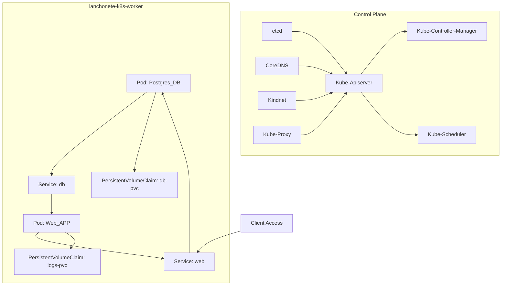

## Infra Kubernetes

### Arquitetura



### Pré-requisitos
- [Kind](https://kind.sigs.k8s.io/docs/user/quick-start/#installation)
- [Kubectl](https://kind.sigs.k8s.io/docs/user/quick-start/#installation)
- [Docker](https://docs.docker.com/engine/install/)


Nessa primeira versão nossa aplicação ficará disponível em cluster Kubernetes local usando o Kind. Por favor, certifique-se de que as ferramentas de pré-requisitos estão instaladas, como nos exemplos:

```bash
❯ kind version
kind v0.24.0 go1.22.6 linux/amd64
```

```bash
❯ kubectl version
Client Version: v1.29.2
Kustomize Version: v5.0.4-0.20230601165947-6ce0bf390ce3
Server Version: v1.31.0
```

### Configurando os clusters usando o Kind

- Execute o script dentro de `./infra/scripts/setup.sh`
- Aguarde alguns minutos até os cluster serem criados, ao final execute `kind get clusters` e deverá exibir:

``` bash
lanchonete-k8s
```
- Com `kubectl get nodes` você visualizará um node control plane e um worker:

```bash
NAME                           STATUS   ROLES           AGE   VERSION
lanchonete-k8s-control-plane   Ready    control-plane   32m   v1.31.0
lanchonete-k8s-worker          Ready    <none>          32m   v1.31.0
```
- Após isso, execute `kubectl get pods -A` para listar todos os pods de todos os namespaces.

```bash
NAMESPACE            NAME                                                   READY   STATUS    RESTARTS   AGE
kube-system          coredns-6f6b679f8f-sj9mn                               1/1     Running   0          83s
kube-system          coredns-6f6b679f8f-vqssg                               1/1     Running   0          83s
kube-system          etcd-lanchonete-k8s-control-plane                      1/1     Running   0          88s
kube-system          kindnet-blq2k                                          1/1     Running   0          84s
kube-system          kindnet-kk4lm                                          1/1     Running   0          80s
kube-system          kube-apiserver-lanchonete-k8s-control-plane            1/1     Running   0          88s
kube-system          kube-controller-manager-lanchonete-k8s-control-plane   1/1     Running   0          88s
kube-system          kube-proxy-2frwg                                       1/1     Running   0          80s
kube-system          kube-proxy-6bhr6                                       1/1     Running   0          84s
kube-system          kube-scheduler-lanchonete-k8s-control-plane            1/1     Running   0          88s
local-path-storage   local-path-provisioner-57c5987fd4-r4tw4                1/1     Running   0          83s
```


### Build do container e publicação no cluster Kind

Agora que o cluster está ativo é só fazer o build da imagem docker da aplicação web (por enquanto esse passo está manual).*

```bash
docker build -t web:1.0 .
```

Assim que for finalizado o build, faça o carregamento da imagem nos nodes do cluster:

```bash
kind load docker-image web:1.0 --name lanchonete-k8s
```

### Deploy do serviços no cluster Kind

Utilizaremos o [Kustomize](https://kustomize.io/) para facilitar a reutilização e o gerenciamento dos manifestos K8S em mais de um ambiente (possível futuro: dev e prod). 


Faça o deploy no Kind sem sobreposições usando:

```bash
kubectl apply -k infra/kubernetes/base
```

```
Output:
deployment.apps/db created
deployment.apps/web created
persistentvolumeclaim/db-pvc created
persistentvolumeclaim/logs-pvc created
service/db created
service/web created
```

Valide que os pods do serviço está em execução:

```bash
kubectl get pods
NAME                   READY   STATUS    RESTARTS      AGE
db-6df5b659cc-8f6rm    1/1     Running   0             33m
web-6d6d4f8cd9-hkc7m   1/1     Running   1 (33m ago)   33m
```

Usando o service do K8S faça port-foward para a porta 2000 e acesse normalmente http://localhost:2000/docs#/

```bash
❯ kubectl get service
NAME         TYPE           CLUSTER-IP      EXTERNAL-IP   PORT(S)          AGE
db           ClusterIP      10.96.146.204   <none>        5432/TCP         30s
kubernetes   ClusterIP      10.96.0.1       <none>        443/TCP          17m
web          LoadBalancer   10.96.103.219   <pending>     2000:31941/TCP   30s
```


```bash
❯ kubectl port-forward svc/web 2000
Forwarding from 127.0.0.1:2000 -> 2000
Forwarding from [::1]:2000 -> 2000
```

> Obs: _* Se você fez alteração no código e deseja mudar a tag da imagem, lembre que será necessário atualizar no manifesto deployment de web em `/infra/kubernetes/development/example-patch-web-dev.yaml` para testar a nova versão._